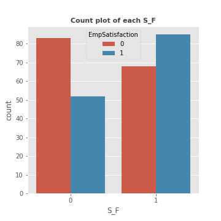

## Bivariate analysis of Salary feature with target

------------------------------------------------------
## Bivariate analysis of PerformanceScore feature with target

------------------------------------------------------
## Bivariate analysis of EngagementSurvey feature with target

------------------------------------------------------
## Bivariate analysis of SpecialProjectsCount feature with target

------------------------------------------------------
## Bivariate analysis of DaysLateLast30 feature with target

------------------------------------------------------
## Bivariate analysis of Absences feature with target

------------------------------------------------------
## Bivariate analysis of DOB_year feature with target

------------------------------------------------------
## Bivariate analysis of DOB_month feature with target

------------------------------------------------------
## Bivariate analysis of DOB_day feature with target

------------------------------------------------------
## Bivariate analysis of DOH_year feature with target

------------------------------------------------------
## Bivariate analysis of DOH_month feature with target

------------------------------------------------------
## Bivariate analysis of DOH_day feature with target

------------------------------------------------------
## Bivariate analysis of P_Architect feature with target

------------------------------------------------------
## Bivariate analysis of P_Director feature with target

------------------------------------------------------
## Bivariate analysis of P_Engineer feature with target

------------------------------------------------------
## Bivariate analysis of P_Manager feature with target

------------------------------------------------------
## Bivariate analysis of P_Other feature with target

------------------------------------------------------
## Bivariate analysis of P_Technician I feature with target

------------------------------------------------------
## Bivariate analysis of P_Technician II feature with target

------------------------------------------------------
## Bivariate analysis of S_F feature with target

------------------------------------------------------
## Bivariate analysis of S_M  feature with target

------------------------------------------------------
## Bivariate analysis of MD_Divorced feature with target

------------------------------------------------------
## Bivariate analysis of MD_Married feature with target

------------------------------------------------------
## Bivariate analysis of MD_Separated feature with target

------------------------------------------------------
## Bivariate analysis of MD_Single feature with target

------------------------------------------------------
## Heatmap

------------------------------------------------------
